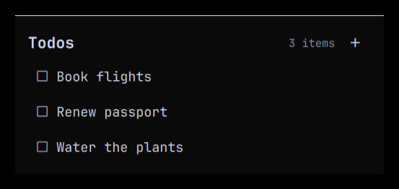
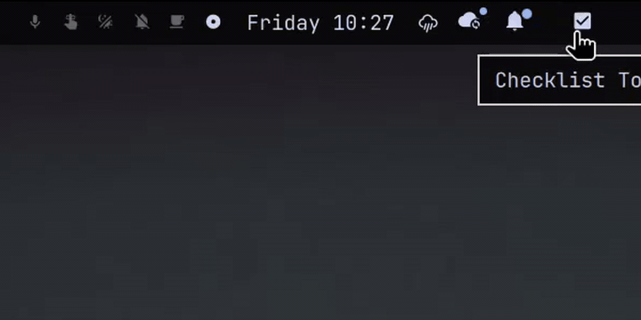

# Checklist Todo

**The todo list that stays out of your way.**

A tiny, no-nonsense checklist for the [Omarchy](https://omarchy.org/) bar. Add an
item, read it, tick it off. No accounts, no sync daemons, no configuration — just
a list that lives in your bar and gets out of your way.





Use it as a general checklist or a lightweight todo list. The whole plugin is
four small files, and your data is a plain JSON file you can read, back up, or
edit by hand.

## Features

- **Add in a keystroke** — type a name and an optional description.
- **One-line list** — just names, each with a checkbox beside it.
- **Details on demand** — click an item to read its description, then go back.
- **Tick to remove** — click the checkbox to delete an item for good.
- **Keyboard-friendly** — `n` or `+` for a new item, `Enter` to save, `Esc` to
  go back or close.
- **Stays in sync** — every monitor's bar shows the same list.
- **Zero dependencies** — no scripts, no services, no network.

## Installation

### From the plugin marketplace

Browse the marketplace and install **Checklist Todo**, or add it directly:

```bash
omarchy plugin add https://github.com/tathagat11/omarchy-checklist-todo --enable
```

### From a local clone

```bash
mkdir -p ~/.config/omarchy/plugins/tathagat11.checklist-todo
cp manifest.json BarWidget.qml Panel.qml Model.js preview.png \
  ~/.config/omarchy/plugins/tathagat11.checklist-todo/
omarchy-shell shell rescanPlugins
omarchy plugin enable tathagat11.checklist-todo --section right
```

## Usage

Click the checkbox icon in the bar to open the list.

| Action | Mouse | Keyboard |
| --- | --- | --- |
| New item | Click `+` | `n` or `+` |
| Open an item | Click its name | — |
| Delete an item | Click its checkbox | — |
| Go back | Click the back arrow | `Esc` |
| Save | Click **Save** | `Enter` |
| Close | Click outside | `Esc` |

Like every bar widget, it can be moved and reordered:

```bash
omarchy bar move tathagat11.checklist-todo --section left
omarchy plugin disable tathagat11.checklist-todo
```

## IPC

The plugin exposes an IPC target for scripting:

```bash
# Add an item
omarchy-shell tathagat11.checklist-todo add "Buy milk" "Semi-skimmed"

# How many items are open
omarchy-shell tathagat11.checklist-todo status

# Remove an item by id
omarchy-shell tathagat11.checklist-todo remove <id>
```

## Data

Your list is stored as plain JSON at:

```
~/.local/state/tathagat11.checklist-todo/todos.json
```

Nothing leaves your machine. Delete the file to start over.

## Uninstall

```bash
omarchy plugin disable tathagat11.checklist-todo
omarchy plugin remove tathagat11.checklist-todo
```

Optionally delete your data:

```bash
rm -rf ~/.local/state/tathagat11.checklist-todo
```

## Development

Validate the manifest and lint the QML:

```bash
omarchy plugin validate .
qmllint -I "$OMARCHY_PATH/shell" BarWidget.qml Panel.qml
```

Edits under `~/.config/omarchy/plugins/` hot-reload on save.

## Changelog

See [CHANGELOG.md](CHANGELOG.md).

## License

[MIT](LICENSE)
